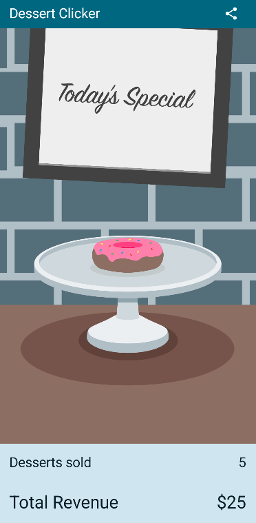

Dessert Clicker app
=====================

Introduction
------------

Dessert Clicker is a game about making and selling desserts.

User can press the image of desserts to make a dessert. Then, user also sells the dessert to earn the big bucks.

What To Learn From This App
---------------------------
- What is Activity Lifecycle? How does Lifecycle process?
- How to deal with configuration changes to prevent the data getting lost by using rememberSaveable method
- How to use Log class
- What is Lifecycle of Composable Functions?
- The logic of Composition and Recomposition processes

Image
------

